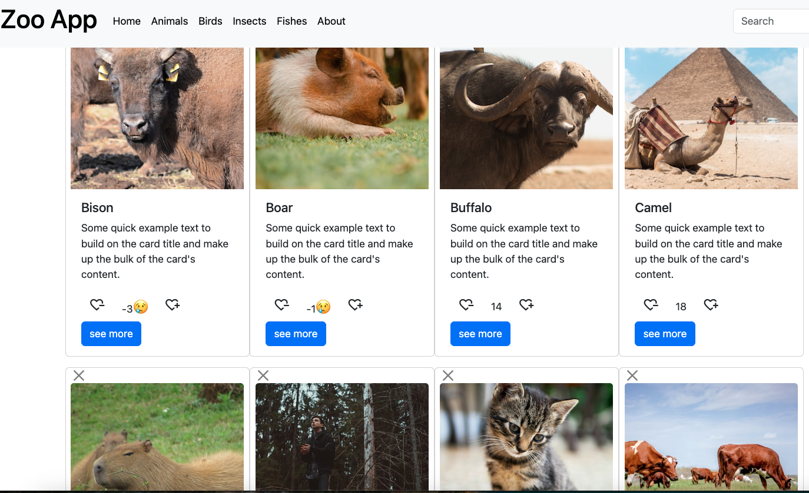

<!-- # React + Vite

This template provides a minimal setup to get React working in Vite with HMR and some ESLint rules.

Currently, two official plugins are available:

- [@vitejs/plugin-react](https://github.com/vitejs/vite-plugin-react/blob/main/packages/plugin-react/README.md) uses [Babel](https://babeljs.io/) for Fast Refresh
- [@vitejs/plugin-react-swc](https://github.com/vitejs/vite-plugin-react-swc) uses [SWC](https://swc.rs/) for Fast Refresh -->
# Project title

```
React Zoo App Project

```

### Description ##

- The project used animals, birds, insects and fishes and it demonstrated key react features such as *state and props*, *hooks*, *routing with react router*.

- 

## Technologies used

Built with: 

- HTML
- JS
- CSS
- Bootstrap
- Reactjs 
- ...

## Setup and usage

Live page [here](https://github.com/margittennosaar/markdown_study_materials)

## Screenshot





## Sources 

- [GitHub Guides - masterin markdown](https://guides.github.com/features/mastering-markdown/)
- [Make a README](https://www.makeareadme.com/)

## Authors and acknowledgment

Margit Tennosaar
- GitHub @margittennosaar
- [LinkedIn](https://www.linkedin.com/in/margittennosaar/)
